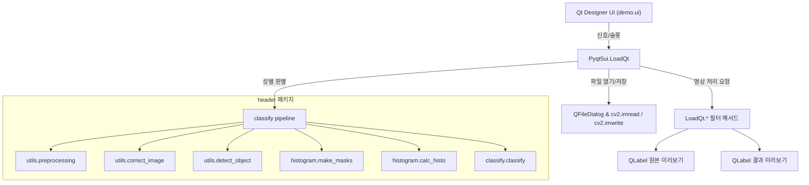

> 📌 **프로젝트 유형**: 데스크톱 애플리케이션 · 컴퓨터 비전 · 인터랙티브 이미지 편집 툴킷

## 1. 프로젝트 개요
CVQT Studio는 PyQt5 기반 GUI와 OpenCV 연산을 결합해 다양한 이미지 보정, 필터링, 특수 효과, 얼굴 성별 분류 기능을 한 번에 실험할 수 있는 데스크톱 응용프로그램입니다. 메뉴와 슬라이더, 체크박스 위젯을 활용해 이미지를 불러오고 회전·스케일 조정부터 주파수 필터, 만화/유화 효과까지 폭넓은 컴퓨터 비전 파이프라인을 실시간으로 확인할 수 있습니다.

## 2. 주요 기능 요약
| 카테고리 | 기능 설명 |
| --- | --- |
| 파일 관리 | 이미지 열기/저장/인쇄, 원본 복원, 확대/축소 |
| 기하 변환 | 회전(QDial 지원), 아핀 변환, 크기 조절 |
| 색상/명암 보정 | 그레이스케일, 네거티브, 히스토그램 평활화, 로그·감마 변환 |
| 노이즈 & 스무딩 | 박스/가우시안/미디언/양방향 블러, 침식·팽창 슬라이더 |
| 주파수/에지 필터 | Canny 에지, 방향성 필터 3종, Butterworth, Notch 필터 (추가 구현 여지) |
| 특수 효과 | 만화, 엠보싱, 연필 스케치(흑백/컬러), 유화 효과(OpenCV xphoto) |
| 성별 분류 | Haar Cascade 얼굴·눈 검출 후 ROI 히스토그램 유사도 기반 성별 예측 |

## 3. 아키텍처 및 데이터 흐름


- **Pyqt5ui.LoadQt**: Qt Designer로 제작한 `demo.ui`를 로드하고 메뉴/슬라이더 신호를 슬롯 메서드에 연결합니다. `self.tmp`(원본) ↔ `self.image`(현재 상태) 버퍼를 유지하며 두 개의 QLabel에 결과를 렌더링합니다.
- **header.utils**: 얼굴 ROI 전처리, 회전 보정, 객체(눈·얼굴) 검출을 담당합니다.
- **header.histogram**: 머리/입술/얼굴 마스크를 생성하고 채널별 히스토그램 및 유사도를 계산합니다.
- **header.classify**: 계산된 유사도로 성별을 판별하고 콘솔/화면 출력과 가이드 도형(ellipse)을 표시합니다.
- **butterworth.Butter**: 주파수 영역 저역 통과 필터 구현을 제공합니다.

## 4. 디렉터리 구조
```
OpenCV-Pyqt5/
├── Pyqt5ui.py            # 메인 애플리케이션 진입점 (LoadQt 클래스)
├── demo.ui               # Qt Designer UI 정의
├── header/
│   ├── classify.py       # 성별 판별 및 표시 로직
│   ├── histogram.py      # 마스크/히스토그램 계산 함수
│   └── utils.py          # 전처리 및 보조 유틸리티
├── butterworth.py        # 버터워스 필터 클래스
├── data/                 # Haar cascade XML 및 샘플 데이터
├── *.png                 # 아이콘 및 샘플 이미지 자산
└── README.md
```

> **경로 주의**: `Pyqt5ui.py`는 기본적으로 `source/pyqt/` 하위 경로를 참조합니다. 현재 저장소 구조에 맞추려면 `loadUi` 및 파일 다이얼로그 경로를 수정하거나 `source/pyqt` 디렉터리를 생성해 `demo.ui`, 아이콘, XML을 배치하세요.

## 5. 실행 전 준비
- **Python**: 3.8 이상 권장 (PyQt5, OpenCV 호환)
- **의존 패키지**: PyQt5, opencv-contrib-python, numpy, scipy, matplotlib(옵션)

```bash
git clone <repository-url>
cd OpenCV-Pyqt5
python -m venv .venv
source .venv/bin/activate  # Windows: .venv\Scripts\activate
pip install --upgrade pip
pip install PyQt5 opencv-contrib-python numpy scipy matplotlib
```

## 6. 애플리케이션 실행
1. `Pyqt5ui.py`에서 `loadUi` 및 `setWindowIcon` 경로가 실제 파일 위치와 일치하는지 확인합니다.
   ```python
   loadUi('demo.ui', self)
   self.setWindowIcon(QtGui.QIcon('python-icon.png'))
   face_cascade = cv2.CascadeClassifier('data/haarcascade_frontalface_alt2.xml')
   ```
2. 필요한 경우 `data/` 경로를 기준으로 Haar cascade XML 파일 경로를 갱신합니다.
3. 애플리케이션을 실행합니다.
   ```bash
   python Pyqt5ui.py
   ```
4. 실행 중 `Invalid Image` 메시지가 나타나면 경로 또는 권한을 확인하세요.

## 7. UI 사용 가이드
- **상단 메뉴**
  - *File*: 이미지 열기, 다른 이름으로 저장, 인쇄, 종료(QMessageBox 확인 포함).
  - *View*: 회전/확대/축소, 다이얼 회전(`rotation2`), 크기 조절(`SIZE`).
  - *Smoothing & Filter*: 블러 계열, 방향성 필터, Butterworth, Notch(추가 구현 필요) 등.
  - *특수효과 · Cartooning*: 만화, 엠보싱, 연필 스케치(흑백·컬러), 유화.
  - *Sex Detect*: 얼굴이 포함된 이미지를 불러오면 성별 판별 결과와 ROI 오버레이를 표시합니다.
- **우측 패널**
  - 회전 각도, 감마, 가우시안 커널 크기, 침식 반복 횟수, 로그 스케일, Canny 임계값 등을 슬라이더로 조절합니다.
  - `Reset` 버튼은 현재 이미지 상태를 원본(`self.tmp`)으로 복원합니다.
- **이미지 라벨**
  - 좌측(`imgLabel`)은 원본 또는 중간 결과, 우측(`imgLabel2`)은 최종 처리 이미지를 보여줍니다.

## 8. 성별 분류 파이프라인
1. **얼굴/눈 검출** – `header.utils.detect_object`가 Haar Cascade(`data/haarcascade_*.xml`)를 사용해 얼굴과 눈 위치를 찾습니다.
2. **회전 보정** – `header.utils.correct_image`가 검출된 눈 좌표로 얼굴을 정렬합니다.
3. **ROI 전처리** – `header.utils.preprocessing`이 머리카락, 입술 등 관심 영역을 추출할 수 있도록 이미지를 정규화합니다.
4. **마스크 생성** – `header.histogram.make_masks`가 머리, 입술, 얼굴 영역 마스크를 생성합니다.
5. **히스토그램 비교** – `header.histogram.calc_histo`가 각 마스크 영역의 색상 히스토그램 유사도를 측정합니다.
6. **결정 로직** – `header.classify.classify`가 유사도 값에 따라 성별을 판단하고, `header.classify.display`/`header.histogram.draw_ellipse`가 결과를 표시합니다.

## 9. 커스터마이징 팁
- **새로운 필터 추가**: `LoadQt` 클래스에 메서드를 정의하고 메뉴 액션을 슬롯에 연결한 뒤, `self.tmp` ↔ `self.image` 흐름을 유지하세요.
- **UI 확장**: Qt Designer로 `demo.ui`를 수정하면 자동 생성된 위젯 이름을 `Pyqt5ui.py`에서 동일하게 참조해야 합니다.
- **전처리 파이프라인 재사용**: `header` 패키지는 독립 모듈로 사용 가능하므로 다른 프로젝트에서도 얼굴 ROI 기반 분류 실험에 활용할 수 있습니다.
- **버터워스/노치 필터**: `butterworth.Butter`를 참고해 추가 파라미터(UI 입력 필드)를 노출하면 주파수 도메인 실험 범위를 넓힐 수 있습니다.


